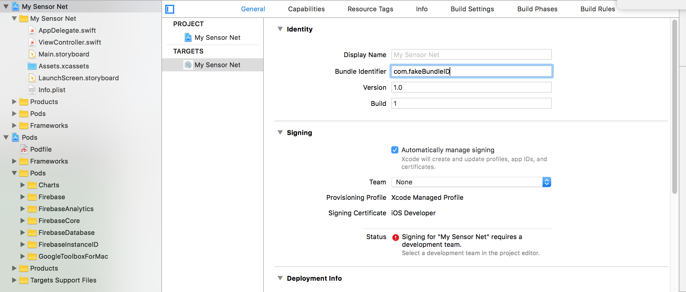

# sensorLink
This is a quick implementation of a cloud connection for IOT Sensors with a native Swift iOS app. Firebase is your friend for prototyping.


The respository is split into two parts: an python3/Rpi portion and a swift/iOS portion.


## Get it Working:

Getting your raspberry pi and your swift app to speak to each other is surprisingly simple, however there is a fair amount of administrative work to be done before setting up the connection. This section of the guide will walk you through the steps of:

1. Setting up your circuit
2. Setting up your Firebase
3. Setting up your RPi
4. Setting up your iPhone

You may need to create a Firebase account if you don't already have one.

#### Set up your circuit!

The schematic below includes a touch sensor and an LED, the first for sending a signal, the second for displaying a recieved signal:

IMAGE

I'm sure you can come up with something more interesting...just remember to update the code accordingly! See the customization section for a more detailed walkthrough.
    
    
#### Get a Firebase!
    
   It's easy, [sign up here](https://firebase.google.com/). Once set up, we need some info from firebase:
   1. Click the ⚙️ -> Project Settings.

   2. Grab your Firebase's API Key and the Project ID. Keep them handy.

   3. Next, click Database. Look for a 🔗 icon near the top of the database. Copy the text next to it (that's your database URL) and keep it for later.

   4. Finally, click Storage and do the same thing. That's your Storage URL.

   With all that in order, lets set up the Raspberry Pi to start sending and recieving signals from your phone.


#### Set up your Pi!
   1.Install pyrebase on your Raspberry Pi's python 3 instance:

    
        sudo pip3 install pyrebase
    
    
   ###### Warning: this could take a while, especially if your are running on a Pi Zero W like myself.
    
   2. While that's going, open up your 'RPy_python/pushReadings.py' script. There should be a section at the top that looks like this:

    ```python
    config = {
    apiKey": "apiKey",
    "authDomain": "projectId.firebaseapp.com",
    "databaseURL": "https://databaseName.firebaseio.com",
    "storageBucket": "projectId.appspot.com"
    }
    ```
    
    
   Fill it out with the information you gathered earlier. Sweet, now your raspberry pi is ready to start speaking with your iphone.
   
   3. When pyrebase is successfully installed, run the script  'RPy_python/pushReadings.py' on your Raspberry pi.
    
#### Set up your iPhone!
   1. Open the provided xcode project 'iPhone_Swift/My Sensor Net'.
   
   
   
   
   
   
   
   
   2. in the terminal in the 'iPhone_Swift' directory
   
  
    


